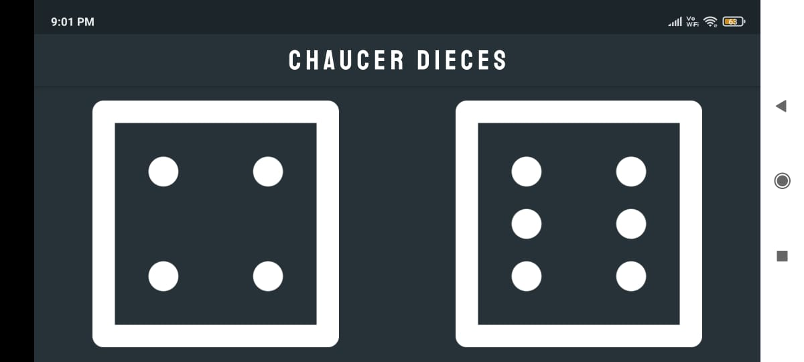
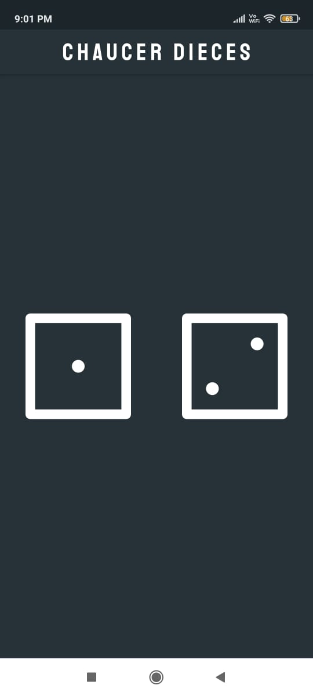

# SIMPLE-CHUSAR-DIECES-FLUTTER-APPLICATION :star_struck:

[](https://shields.io/) [](https://shields.io/) [](https://shields.io/) [](https://shields.io/) [](https://shields.io/)

***This new Web application is created by Biswarup Bhattacharjee, student of BTECH, in University of Engineering and Management, Kolkata.***

**Email Id: bbiswa471@gmail.com.** 

**Contact No: 916290272740.** 

[](https://www.facebook.com/biswarup.bhattacharjee.5811) [](https://github.com/biswa2210)

## About :point_down: 
It is a flutter application named ‘Chausar Dices’. It is a simple app which shows chausar dices. These dices randomly generates dots of different numbers from 1 to 6. These are used for a game. Chaupar (IAST: caupaṛ), chopad or chaupad is a cross and circle board game very similar to pachisi, played in India. The board is made of wool or cloth, with wooden pawns and seven cowry shells to be used to determine each player's move, although others distinguish chaupur from pachisi by the use of three four-sided long dice.[1] Variations are played throughout India.[2] It is similar in some ways to Pachisi, Parcheesi and Ludo. In most of the villages of Punjab, Haryana and Rajasthan, this game is played by old persons. A chopat 'board' is traditionally an embroidered cloth in the shape of a cross. Each arm of the cross is divided into three columns and each column is divided into eight squares. The “dice” are seven cowry shells. The “men” or pieces (Sogthi)are usually made of wood. Each player has four men, although variants exist using 8 men each. A maximum of four players play this game, each sitting in front of an arm of the cross. The centre of the cross is “ghar" or "home”. He center column on each arm of the cross is the "home column" for each player's men after they cross the flower motif. The starting point for each player is the flower motif on the column to the left of his home column. Each player has to enter his four men into the game from the starting point. The men travel around the outer perimeter columns in an anti-clockwise direction. Before a player can bring any of his own men “home”, he has to knock out at least one man of another player. This is called a “tohd”. Only the player's own men can enter the home column of each player. Once the men cross the flower motif, they are played by laying the pieces on their side to indicate they are in their final home stretch and are safe now from any further attack. It is fully responsive means when we change the orientation of our android or iphone the app fits perfectly.
## APP DOWNLOAD LINK : :point_right: <a href="https://github.com/biswa2210/simple_chausar_dice/raw/master/Chausar_Dieces_base.apk" download>Click here to download</a> 
## Purpose :point_down:
I have made this for playing this game. Those who don't have idea of this they can also know it from this.
## Use :point_down:
User just has to tap on any chausar dice.
## Folder Structure :point_down:
```bash
simple-covid-tracker
       ├── assets
       |     ├── 2.0x
       |     ├── 3.0x
       |     ├── fonts
       |     |    └── MBW.otf
       |     ├── count.png
       |     ├── death.png
       |     ├── fever.png
       |     ├── patient.png
       |     └── suspect.png
       ├── lib
       |    ├── app
       |    |    ├── repositries
       |    |    |       ├── data_repositries.dart
       |    |    |       └── endpointsdatas.dart
       |    |    ├── services
       |    |    |       ├── .gitignore
       |    |    |       ├── api.dart
       |    |    |       ├── app_services.dart
       |    |    |       ├── data_cache_service.dart
       |    |    |       └── endpointdata.dart
       |    |    └── ui
       |    |         ├── dashboard.dart
       |    |         ├── endpoint.dart
       |    |         ├── last_updated_date.dart
       |    |         └── show_alert_dialog.dart
       |    └── main.dart
       └── rest_api
              └── ncov_2019_api.http
```
     
## Making :point_down:
 I have used [FLUTTER](https://flutter.dev/?gclid=Cj0KCQjw38-DBhDpARIsADJ3kjliHdMH2hA97bBGqJtW5ORUUksCxpZ8cnrSWaH__HevGftAmP8AmvIaAhNlEALw_wcB&gclsrc=aw.ds) and [Dart](https://dart.dev/) in front end and backend.
## Getting Started

This project is a starting point for a Flutter application.

A few resources to get you started if this is your first Flutter project:

- [Lab: Write your first Flutter app](https://flutter.dev/docs/get-started/codelab)
- [Cookbook: Useful Flutter samples](https://flutter.dev/docs/cookbook)

For help getting started with Flutter, view our
[online documentation](https://flutter.dev/docs), which offers tutorials,
samples, guidance on mobile development, and a full API reference.
## Screenshots :point_down: 
<div align="center">
<a href="C1.jpeg"></a> <br>
<a href="C2.jpeg"></a>
</div>


